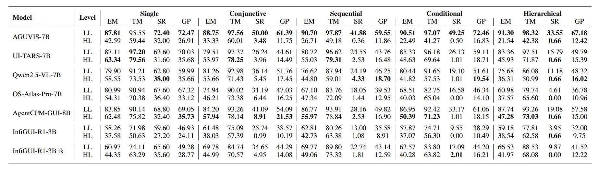
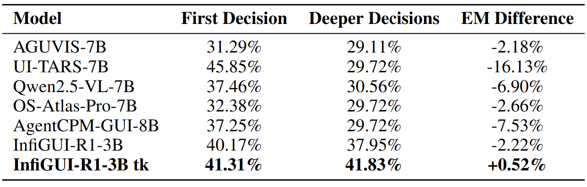

# GAMBIT: A Graph-Structured and Decision-Aware Benchmark for Mobile GUI Tasks

This repository contains the official dataset and evaluation code for GAMBIT.

> [GAMBIT: A Graph-structured and Decision-Aware Benchmark for MoBile GUI Tasks](https://openreview.net/pdf?id=MDxLNScqiK)  
> Anonymous Authors

## 🧭 Release
- [2025/10/26] 🤗 GAMBIT dataset available on [HuggingFace](https://huggingface.co/datasets/melonthrower12138/GAMBIT).
- [2025/10/24] 🎉 [Github repo](https://github.com/melonthrower/GAMBIT/tree/master) for **GAMBIT** is online.

## 💡 Introduction
GAMBIT is a benchmark designed to evaluate mobile GUI agents on long-horizon planning and complex decision-making tasks. While existing benchmarks for mobile GUI agents primarily focus on short, linear workflows, they offer limited insight into an agent's capabilities for conditional reasoning and long-term planning. GAMBIT addresses this gap by introducing graph-structured, decision-aware tasks that systematically evaluate and advance the capabilities of modern agents in realistic scenarios.

## 📖 Key Features

*   **🧠 Decision-Aware Tasks**: Tasks go beyond simple linear sequences to include **conditional branches**, **multi-step constraints**, mirroring real-world user interactions.
*   **📊 Graph-Structured Workflows**: Tasks are organized into four canonical topologies: **Sequential**, **Conjunctive**, **Conditional**, and **Hierarchical**, offering a systematic progression in complexity.
*   **📱 Cross-Platform & Diverse Applications**: Covers both **Android** and **iOS** platforms, spanning **35 mainstream applications** across 7 categories to ensure broad relevance.
*   **📝 Dual-Level Annotations**: Provides both goal-oriented and step-by-step instructions, enabling distinct evaluations of an agent's planning and execution abilities.
*   **📈 Novel Evaluation Metrics**: Introduces **Weighted Longest Common Subsequence (W-LCS)** and **Decision Accuracy** to more faithfully measure performance on long-horizon and branching tasks.


## 🛠️ Data Construction Pipeline


The GAMBIT dataset was constructed through a principled, human-LLM collaborative pipeline designed to ensure task diversity, realism, and complexity. The process can be summarized in three key stages:

1.  **Atomic Instruction Generation**: We create a diverse library of atomic instructions and constraints through a cycle of human-seeding, LLM-augmentation, and rigorous human-in-the-loop verification.
2.  **Graph-Structured Task Composition**: These atomic instructions are composed into complex tasks using four predefined graph topologies: **Conjunctive, Sequential, Conditional, and Hierarchical**. A mixture-of-generators strategy involving multiple LLMs and double-pass human verification ensures high-quality, decision-aware workflows.
3.  **High-Fidelity Annotation**: Each task is executed and annotated by professional annotators on real devices, featuring dual-level instructions and undergoing a three-stage quality review to guarantee accuracy.

For more details on our data creation methodology, please refer to our [paper](https://openreview.net/pdf?id=MDxLNScqiK).


## 📈 Results

Our evaluations show that GAMBIT induces a substantial performance drop compared to prior benchmarks.


There is a clear monotonically decreasing trend in success rate (SR) and goal progress (GP) as topological complexity increases.



The average branch **decision accuracy** on Conditional and Hierarchical tasks is **only 38%**.

These findings highlight the limitations of current agents in complex reasoning and long-horizon planning, establishing GAMBIT as a challenging and diagnostic testbed for future research.


## Citation

If you find GAMBIT useful in your research, please consider citing our paper:

```bibtex
@article{anonymous2026gambit,
  title={{GAMBIT}: {A} Graph-Structured and Decision-Aware Benchmark for Mobile {GUI} Tasks},
  author={Anonymous Authors},
  journal={Submitted to International Conference on Learning Representations (ICLR)},
  year={2026}
}
```

## License

This project is licensed under a Non-Commercial License. See the [LICENSE](LICENSE) file for details.
